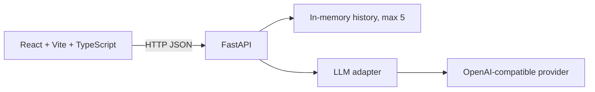

# AI Team Assistant

Мини-дашборд для команды: пользователь выбирает роль AI-ассистента, задает вопрос, получает аккуратно оформленный Markdown-ответ и может вернуться к последним пяти запросам.

Проект сделан как учебный fullstack MVP под формат короткого тестового задания. Фокус не только на вызове LLM, а на законченном пользовательском сценарии, понятной структуре, безопасном backend-контракте и проверяемом качестве.

## Возможности

- 4 режима ассистента: Brainstormer, Code Reviewer, Product Manager, Technical Writer.
- Отправка запроса в OpenAI-compatible API через FastAPI backend.
- Markdown-рендеринг ответа, включая списки, заголовки и блоки кода.
- Кнопка копирования ответа.
- История последних 5 успешных запросов с ролью и временем.
- Loading/error states на frontend.
- Безопасные ответы об ошибках без утечки внутренних exception details.
- Health endpoint для smoke-test и будущего deployment.

## Архитектура



Backend хранит секретный API key только в локальном `.env`. Frontend обращается к backend через `VITE_API_BASE_URL` и не знает токен провайдера.

## Структура

```text
.
├── backend/
│   ├── main.py              # FastAPI routes, validation, errors, history
│   ├── llm.py               # LLM client and role-specific system prompts
│   ├── requirements.txt
│   ├── .env.example
│   └── tests/
│       └── test_main.py
├── frontend/
│   ├── src/
│   │   ├── App.tsx
│   │   ├── api.ts
│   │   ├── types.ts
│   │   └── components/
│   ├── .env.example
│   ├── package.json
│   └── vite.config.ts
├── .gitignore
└── README.md
```

Локальные заметки, черновики, AI history и внутренние документы не входят в публичную часть проекта.

## Локальный запуск

### Backend

```bash
cd /Users/vladislavpoteryaev/Development/ai-dashbord/backend
source venv/bin/activate
python3 -m uvicorn main:app --reload --port 8000
```

Если окружение создается с нуля:

```bash
cd /Users/vladislavpoteryaev/Development/ai-dashbord/backend
python3 -m venv venv
source venv/bin/activate
pip install -r requirements.txt
cp .env.example .env
```

После этого заполнить `backend/.env` реальными значениями.

### Frontend

```bash
cd /Users/vladislavpoteryaev/Development/ai-dashbord/frontend
npm install
npm run dev
```

Открыть `http://localhost:5173`.

## Переменные окружения

Backend, файл `backend/.env`:

| Переменная | Назначение |
|---|---|
| `BASE_URL` | URL OpenAI-compatible API |
| `MODEL_NAME` | Модель у выбранного провайдера |
| `API_KEY` | Секретный ключ провайдера |
| `LLM_TIMEOUT_SECONDS` | Timeout запроса к LLM |
| `FRONTEND_ORIGINS` | Разрешенные frontend origins для CORS |

Frontend, файл `frontend/.env`:

| Переменная | Назначение |
|---|---|
| `VITE_API_BASE_URL` | URL backend API |

Файлы `.env`, `.aider.chat.history.md`, `.aider.input.history`, `.codex/` и `docs/` не должны попадать в GitHub.

## Проверка качества

Backend unit tests:

```bash
cd /Users/vladislavpoteryaev/Development/ai-dashbord
backend/venv/bin/python -m pytest backend/tests -q
backend/venv/bin/python -m compileall -q backend
```

Frontend build and lint:

```bash
cd /Users/vladislavpoteryaev/Development/ai-dashbord/frontend
npm run build
npm run lint
```

Smoke-test живого backend:

```bash
curl -i http://127.0.0.1:8000/health
curl -i http://127.0.0.1:8000/history
```

POST `/chat` можно проверить через Swagger UI:

```text
http://127.0.0.1:8000/docs
```

## Ошибки LLM-провайдера

Backend не возвращает пользователю сырой текст exception. Клиент получает безопасный контракт:

```json
{
  "error": {
    "code": "LLM_PROVIDER_ERROR",
    "message": "AI provider returned an error.",
    "request_id": "..."
  }
}
```

Например, `503 Service Unavailable` от TokenRouter с `cache_only_cold` означает, что провайдер временно не принял cold/overloaded request. В таком случае frontend показывает понятную ошибку, а backend пишет подробности только в серверный лог.

## Текущие ограничения

- История хранится в памяти процесса и очищается при перезапуске backend.
- Нет авторизации и multi-user режима.
- Нет базы данных и persistent storage.
- Retry/backoff стратегия минимальная, чтобы поведение было предсказуемым для MVP.
- Deployment еще не подключен.

## Roadmap

- Улучшить visual design и mobile layout.
- Расширить system prompts под реальные командные сценарии.
- Добавить retry/backoff для временных provider errors.
- Подготовить приватный GitHub repository.
- Развернуть backend на Render или аналоге.
- Развернуть frontend на Vercel.
- Добавить CI: backend tests, frontend lint, frontend build.
