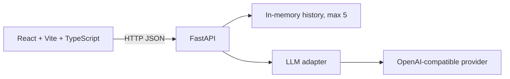

# AI Team Assistant

Мини-дашборд для команды: выберите роль AI-ассистента, задайте вопрос, получите структурированный Markdown-ответ и вернитесь к истории последних пяти запросов.

Проект создан как учебный fullstack MVP для демонстрации интеграции с LLM, построения безопасного API и минималистичного, но функционального интерфейса. Акцент сделан на законченном пользовательском сценарии, чистой структуре проекта и понятной обработке ошибок.

## Возможности

- 4 режима ассистента: Brainstormer, Code Reviewer, Product Manager, Technical Writer.
- Отправка запроса в OpenAI-compatible API через FastAPI backend.
- Markdown-рендеринг ответа: заголовки, списки, блоки кода и таблицы.
- Копирование ответа в буфер обмена.
- История последних 5 успешных запросов с ролью и временем.
- Loading/error states на frontend.
- Безопасный backend-контракт ошибок без утечки внутренних exception details.
- Health endpoint для smoke-test и будущего deployment.

## Архитектура



Frontend обращается к backend через `VITE_API_BASE_URL`. Backend хранит API key только в server-side environment и вызывает LLM-провайдера через OpenAI-compatible клиент.

## Структура проекта

```text
ai-dashbord/
├── backend/
│   ├── main.py              # FastAPI routes, CORS, error handlers, history
│   ├── llm.py               # LLM client and role-specific system prompts
│   ├── requirements.txt
│   ├── .env.example
│   └── tests/
│       └── test_main.py
├── frontend/
│   ├── src/
│   │   ├── App.tsx
│   │   ├── api.ts
│   │   ├── types.ts
│   │   └── components/
│   ├── .env.example
│   ├── package.json
│   ├── package-lock.json
│   └── vite.config.ts
├── .gitignore
└── README.md
```

## Быстрый старт

### Backend

```bash
cd backend
python3 -m venv venv
source venv/bin/activate
pip install -r requirements.txt
cp .env.example .env
python3 -m uvicorn main:app --reload --port 8000
```

После запуска:

- Swagger UI: `http://127.0.0.1:8000/docs`
- Health check: `http://127.0.0.1:8000/health`

### Frontend

```bash
cd frontend
npm install
cp .env.example .env
npm run dev
```

Откройте `http://localhost:5173`.

## Переменные окружения

Backend, файл `backend/.env`:

| Переменная | Назначение |
|---|---|
| `BASE_URL` | URL OpenAI-compatible API |
| `MODEL_NAME` | Модель у выбранного провайдера |
| `API_KEY` | Секретный ключ провайдера |
| `LLM_TIMEOUT_SECONDS` | Timeout запроса к LLM |
| `MAX_OUTPUT_TOKENS` | Максимальная длина ответа модели |
| `FRONTEND_ORIGINS` | Разрешенные frontend origins для CORS |

Frontend, файл `frontend/.env`:

| Переменная | Назначение |
|---|---|
| `VITE_API_BASE_URL` | URL backend API |

Файлы `.env`, `.aider.chat.history.md`, `.aider.input.history`, `.codex/` и `docs/` не должны попадать в GitHub.

## Проверка качества

Backend:

```bash
backend/venv/bin/python -m pytest backend/tests -q
backend/venv/bin/python -m compileall -q backend
```

Frontend:

```bash
cd frontend
npm run build
npm run lint
```

Smoke-test:

```bash
curl -i http://127.0.0.1:8000/health
curl -i http://127.0.0.1:8000/history
```

POST `/chat` можно проверить через Swagger UI или curl:

```bash
curl -X POST http://127.0.0.1:8000/chat \
  -H "Content-Type: application/json" \
  -d '{"prompt": "Предложи три идеи для командного AI-сервиса", "mode": "brainstormer"}'
```

## Обработка ошибок

Backend не передает клиенту сырые исключения LLM-провайдера. Вместо этого возвращается стандартизированный JSON-ответ:

```json
{
  "error": {
    "code": "LLM_PROVIDER_ERROR",
    "message": "AI provider returned an error.",
    "request_id": "..."
  }
}
```

Детали пишутся в серверный лог и доступны разработчику по `request_id`.

## Deployment

Рекомендуемая схема для MVP:

- backend: Render Web Service, root directory `backend`;
- frontend: Vercel, root directory `frontend`;
- секретный `API_KEY` хранится только в Render;
- `VITE_API_BASE_URL` в Vercel указывает на публичный URL Render backend;
- `FRONTEND_ORIGINS` в Render содержит Vercel-домен frontend.

## Текущие ограничения

- История хранится в памяти процесса и очищается при перезапуске backend.
- Нет авторизации и multi-user режима.
- Нет базы данных и persistent storage.
- Retry/backoff стратегия минимальная, чтобы поведение было предсказуемым для MVP.
- На бесплатном Render backend может засыпать после периода бездействия.

## Планы развития

- Персистентное хранение истории в SQLite/PostgreSQL.
- Streaming responses через Server-Sent Events.
- Загрузка файлов как контекст для анализа кода или документов.
- Метрики запросов и времени ответа.
- Dockerfile и CI/CD pipeline.
