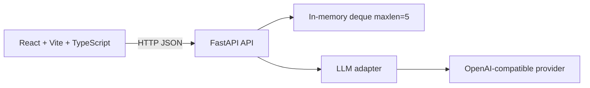

# AI Team Assistant Dashboard

Учебный fullstack-проект: локальный веб-дашборд с несколькими ролями AI-ассистента.
Проект используется одновременно как MVP для тестового задания и как учебный стенд
для освоения FastAPI, React/TypeScript, LLM-интеграций, тестирования и деплоя.

> Статус: учебный MVP, local-first. Это не production-сервис и не публичный проект.

## Что решает продукт

Пользователь задаёт вопрос и выбирает роль помощника:

- Code Reviewer — анализ кода и архитектуры;
- Product Manager — требования, MVP и приоритизация;
- Technical Writer — документация и инструкции;
- Brainstormer — генерация и оценка идей.

Обязательный сценарий: ввести вопрос → отправить его в LLM → увидеть ответ →
скопировать ответ → открыть один из последних пяти запросов.

## Архитектура



Текущий MVP намеренно не использует базу данных и авторизацию. Это допустимо для
локального тестового задания, но должно быть явно обозначено как ограничение.

## Структура проекта

```text
.
├── backend/
│   ├── main.py              # FastAPI routes, validation, CORS, history
│   ├── llm.py               # LLM client and role-specific prompts
│   ├── requirements.txt
│   └── .env.example
├── frontend/
│   ├── src/
│   │   ├── App.tsx
│   │   ├── api.ts
│   │   ├── types.ts
│   │   └── components/
│   ├── package.json
│   └── vite.config.ts
├── docs/
│   ├── technical-specification.md
│   ├── mentorship-roadmap.md
│   └── test-task-follow-up.md
└── README.md
```

## Локальный запуск

### Backend

```bash
cd backend
python3 -m venv .venv
source .venv/bin/activate
pip install -r requirements.txt
cp .env.example .env
# Заполнить .env локальным ключом и моделью
uvicorn main:app --reload --port 8000
```

### Frontend

В другом терминале:

```bash
cd frontend
npm ci
npm run dev
```

Открыть `http://localhost:5173`.

Текущая версия frontend использует URL backend, зашитый в `src/api.ts`. Это один из
первых пунктов следующего спринта: заменить его на `VITE_API_BASE_URL` с безопасным
значением по умолчанию для localhost.

## Переменные окружения

Backend читает:

| Переменная | Назначение |
|---|---|
| `BASE_URL` | URL OpenAI-compatible API |
| `MODEL_NAME` | Идентификатор модели у провайдера |
| `API_KEY` | Секретный ключ провайдера |

Никогда не добавляйте `.env`, ключи и содержимое Aider/Codex history в Git,
скриншоты, публичные issue или prompt для внешнего агента. Если ключ уже попал
в историю терминала или Aider, его нужно отозвать и выпустить заново.

## Проверки качества

Перед демонстрацией должны проходить:

```bash
cd frontend
npm run build
npm run lint
```

Для backend целевой набор команд:

```bash
python -m compileall backend
pytest
```

Текущие известные проблемы зафиксированы в [техническом ТЗ](docs/technical-specification.md).

## Документы проекта

- [Техническое ТЗ и критерии приёмки](docs/technical-specification.md)
- [Roadmap обучения и работы с AI-агентами](docs/mentorship-roadmap.md)
- [Reference design и стек компании](docs/reference-design-and-stack.md)
- [Диагностика и deployment](docs/troubleshooting-and-deployment.md)
- [Шаблон сообщения контакту по тестовому](docs/test-task-follow-up.md)

## План развития

1. Стабилизировать текущий local MVP: build, lint, Markdown, ошибки и конфигурация.
2. Добавить автоматические тесты и единый контракт ошибок.
3. Улучшить модель истории: `id`, `mode`, `created_at`, полный exchange.
4. Добавить мобильный responsive UI и доступность.
5. Подготовить Docker/production build и бесплатный preview deployment.
6. Только после этого добавлять persistent storage, авторизацию и multi-user режим.
