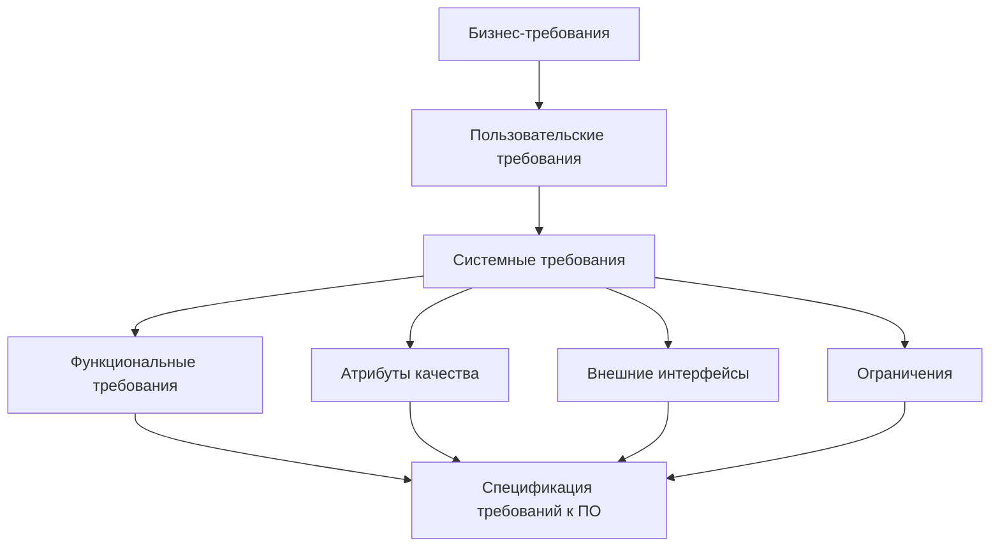
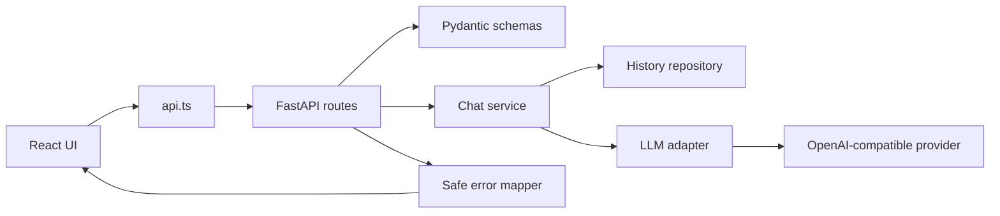

# Техническое задание: AI Team Assistant Dashboard

**Версия:** 0.1

**Статус:** draft / baseline для учебного MVP

**Роль документа:** единый источник требований для аналитика, разработчика,
AI-агента и проверяющего.

## 1. Контекст и цель

Команде нужен простой интерфейс, который позволяет быстро получить ответ от LLM
в контексте конкретной рабочей роли. Пользователь не должен каждый раз писать
длинный system prompt вручную.

Цель первой версии — доказать сквозной путь:

```text
User intent → UI → HTTP API → role prompt + user prompt → LLM → formatted answer → history
```

Первая версия рассчитана на одного пользователя, localhost и демонстрацию.

## 2. Границы системы

### In scope

- React/Vite/TypeScript frontend;
- FastAPI/Python backend;
- OpenAI-compatible LLM provider;
- четыре фиксированные роли помощника;
- ввод вопроса и отправка запроса;
- loading, success и error states;
- Markdown-рендеринг ответа;
- копирование ответа;
- последние пять запросов в памяти;
- responsive layout для desktop и mobile;
- локальный запуск и публичный preview deployment.

### Out of scope для MVP

- регистрация и авторизация;
- несколько пользователей и изоляция данных;
- база данных и долговременное хранение истории;
- streaming tokens;
- загрузка файлов и RAG;
- биллинг, лимиты пользователя и админ-панель;
- обещание 24/7 availability на бесплатном тарифе.

## 3. Трассировка требований

Диаграмма из исходного запроса правильно задаёт направление анализа: бизнес-цели
порождают пользовательские требования, затем системные и функциональные требования,
а ограничения и quality attributes попадают в спецификацию ПО.



## 4. Бизнес-требования

| ID | Требование | Критерий результата |
|---|---|---|
| BR-01 | Сократить время получения типового рабочего ответа | Пользователь получает ответ через один экран и один запрос |
| BR-02 | Показать осмысленное применение LLM | Роли имеют разные system prompts и формат ответа |
| BR-03 | Дать демонстрируемый MVP за ограниченное время | Проект запускается локально по README |
| BR-04 | Сохранить возможность развития | Backend, frontend, LLM и документы разделены по ответственности |

## 5. Пользовательские требования

| ID | Пользователь хочет | Приёмка |
|---|---|---|
| UR-01 | Ввести вопрос | В textarea можно ввести непустой текст |
| UR-02 | Выбрать роль | Доступны четыре роли, активная роль визуально выделена |
| UR-03 | Получить ответ | После отправки отображается ответ или понятная ошибка |
| UR-04 | Понимать, что запрос выполняется | Во время запроса виден loading state, повторная отправка заблокирована |
| UR-05 | Вернуться к недавнему запросу | Клик по history восстанавливает prompt, answer и mode |
| UR-06 | Скопировать ответ | Кнопка копирования сообщает об успехе и не ломает интерфейс при отказе clipboard API |
| UR-07 | Пользоваться телефоном | Основной сценарий работает на viewport от 320px |

## 6. Функциональные требования

### FR-01. Chat input

Система должна принимать текстовый prompt. Пустой или состоящий только из пробелов
prompt не отправляется. Backend повторно валидирует это правило.

### FR-02. Assistant modes

Допустимые значения `mode`:

- `code-reviewer`;
- `product-manager`;
- `technical-writer`;
- `brainstormer`.

Неизвестный mode отклоняется с HTTP 400.

### FR-03. Role-specific prompting

Каждый mode должен выбирать отдельный system prompt. User prompt передаётся отдельно
и не должен подменять system instructions.

### FR-04. LLM request

Backend использует OpenAI-compatible async client и отправляет:

```json
{
  "model": "MODEL_NAME",
  "messages": [
    {"role": "system", "content": "role prompt"},
    {"role": "user", "content": "user prompt"}
  ]
}
```

### FR-05. Answer rendering

Ответ хранится как Markdown и на frontend отображается с заголовками, списками,
ссылками и code blocks. Сырой HTML по умолчанию не должен исполняться.

### FR-06. History

История MVP ограничена пятью последними успешными exchange и хранится в памяти
процесса. Целевая модель элемента:

```json
{
  "id": "uuid",
  "mode": "code-reviewer",
  "prompt": "Как улучшить этот endpoint?",
  "answer": "## Рекомендации...",
  "created_at": "2026-08-09T10:00:00Z"
}
```

После шестого успешного запроса самый старый элемент удаляется.

### FR-07. Copy

Кнопка копирует plain-text/Markdown answer через Clipboard API. При недоступном
API пользователь получает fallback-сообщение, а приложение не падает.

### FR-08. Error handling

Внешний клиент получает только безопасное сообщение. Внутренняя причина пишется
в server-side log с `request_id`.

Целевой контракт:

```json
{
  "error": {
    "code": "LLM_PROVIDER_UNAVAILABLE",
    "message": "AI service is temporarily unavailable.",
    "request_id": "req_123"
  }
}
```

Минимальные коды: `VALIDATION_ERROR`, `CONFIGURATION_ERROR`,
`LLM_PROVIDER_UNAVAILABLE`, `INTERNAL_ERROR`.

### FR-09. Health check

Backend должен иметь `GET /health`, который проверяет доступность приложения без
вызова платной LLM. Для deployment желательно добавить отдельную проверку конфигурации.

## 7. Нефункциональные требования

| ID | Область | Требование |
|---|---|---|
| NFR-01 | Безопасность | API keys не попадают в Git, frontend bundle, ответы API и публичные логи |
| NFR-02 | Надёжность | HTTP timeout для LLM задан явно; provider errors преобразуются в контролируемый ответ |
| NFR-03 | Поддерживаемость | LLM adapter не смешивается с HTTP и UI логикой |
| NFR-04 | Конфигурация | URL provider и frontend API URL задаются окружением |
| NFR-05 | Mobile UX | Нет горизонтального overflow на 320px; элементы доступны touch-взаимодействию |
| NFR-06 | Доступность | Кнопки имеют понятные labels, focus state и disabled state |
| NFR-07 | Наблюдаемость | Ошибки логируются с типом ошибки и request id без секретов |
| NFR-08 | Проверяемость | Build, lint и тесты запускаются одной понятной последовательностью |

## 8. API-контракт

### `POST /chat`

Request:

```json
{
  "prompt": "Сделай ревью функции...",
  "mode": "code-reviewer"
}
```

Success `200`:

```json
{
  "answer": "## Общая оценка\n...",
  "history_item": {
    "id": "uuid",
    "mode": "code-reviewer",
    "prompt": "Сделай ревью функции...",
    "created_at": "2026-08-09T10:00:00Z"
  }
}
```

### `GET /history`

Возвращает массив из 0–5 элементов в порядке от нового к старому.

### `GET /health`

Возвращает `200` и `{"status":"ok"}` без обращения к LLM provider.

## 9. Целевая архитектура



На текущем этапе достаточно модулей, а не полноценной микросервисной архитектуры.
Главная цель — разделить ответственность и не усложнить двухчасовой MVP.

## 10. Критерии готовности

### Definition of Done для MVP

- `npm run build` проходит без ошибок;
- `npm run lint` проходит без ошибок;
- backend запускается по README;
- запрос с каждой ролью доходит до LLM;
- пустой prompt и неизвестный mode дают 400;
- provider failure не раскрывает exception text клиенту;
- история оставляет только пять элементов;
- history восстанавливает полный exchange;
- Markdown и code block отображаются корректно;
- copy failure не вызывает unhandled rejection;
- UI работает на desktop и ширине 320px;
- ключи отсутствуют в Git, frontend и логах;
- есть smoke/unit tests для validation, history и error mapping.

## 11. План реализации на 12–16 часов

### Этап 0 — 30–60 минут: baseline

- README, `.gitignore`, `.env.example`;
- зафиксировать текущие проблемы и команды запуска;
- создать Git repository локально, когда станет удобно сохранять checkpoints.

### Этап 1 — 1–2 часа: frontend quality gate

- исправить type-only import;
- исправить `useEffect` и async lifecycle;
- добавить `react-markdown`;
- вынести API URL в Vite env;
- обработать clipboard errors.

### Этап 2 — 2–4 часа: backend contract

- заменить `str` mode на `Literal`/enum;
- добавить `id`, `mode`, `created_at` в history;
- ввести единый error schema;
- скрыть внутренние exception details;
- добавить request id и безопасное логирование;
- добавить timeout и ограниченный retry для временных provider errors.

### Этап 3 — 2–3 часа: tests

- backend tests для validation, history maxlen и error mapping;
- frontend typecheck/lint/build;
- ручной smoke-test всех четырёх ролей;
- проверить mobile viewport и clipboard failure.

### Этап 4 — 2–3 часа: UX/mobile

- responsive layout без горизонтального overflow;
- доступные focus/disabled states;
- prompt preview и timestamp в history;
- сохранить текущий answer во время следующего loading;
- добавить empty/error/loading states.

### Этап 5 — 2–4 часа: deployment

- Dockerfile или production build;
- Render/Railway/Fly.io/Vercel strategy;
- frontend и backend environment variables;
- health check;
- smoke-test публичного URL;
- документация free-tier ограничений.

## 12. Риски

- Бесплатный LLM provider может вернуть 401/429/5xx или закончить trial quota.
- Бесплатный hosting может усыплять backend и давать холодный старт.
- In-memory history исчезает при restart/deploy и не разделяется между workers.
- Public demo с provider API key требует server-side proxy; ключ нельзя помещать во frontend.
- Сырые Aider/Codex history могут содержать секреты и исходный код.

## 13. Design и stack alignment

Reference HTML использует editorial landing pattern: topbar, hero-copy, крупную
типографику, CTA, board cards, section-copy и data-driven grids. Эти принципы
переносятся в dashboard, но не копируются буквально: dashboard должен выдерживать
частое взаимодействие, loading/error states и мобильный viewport.

Целевой UI stack для следующего дизайн-спринта:

- React + TypeScript;
- Tailwind CSS;
- shadcn/ui primitives;
- semantic design tokens;
- keyboard/focus/disabled states;
- responsive layout от 320px.

Текущий Vite не нужно немедленно заменять на Next.js. Миграция оправдана после
стабилизации MVP, если появятся SEO-страницы, auth boundaries, server rendering
или единый публичный продукт. Полная карта reference и соответствие компонентов
описаны в `docs/reference-design-and-stack.md`.

## 14. Git и история решений

Git пока не инициализируется автоматически: это отдельное упражнение, которое
владелец проекта выполняет вручную через терминал после проверки `.gitignore` и
отзыва старого ключа.

История должна показывать инженерную последовательность, а не один огромный dump:

```text
chore: establish project baseline
docs: add technical specification and roadmap
feat(ui): align dashboard with reference design
fix(frontend): restore build and lint quality gate
feat(api): add safe error contract and history metadata
test: cover chat validation and history retention
docs: add deployment runbook
```

Каждый commit должен иметь проверяемый результат и ссылаться на часть ТЗ.

